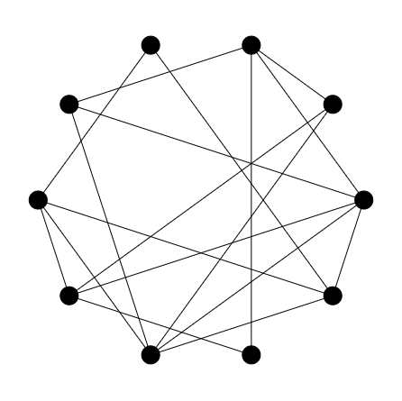

# JS-Tangle_Game:

[Play now!](https://jkutkut.github.io/JS-Tangle_Game/)

This simple game has only one objective: untangle the net. By clicking and dragging the points of the net, you can change the shape of the net to untangle it.

When the untangled, you won the game!

## Controls
| Key | Effect |
| :---: | --- |
| **r** | Generate a new level with the current amount of points. |
| **space** | If the current level is done, go to the next one. |
| **n** | Change number of points. |
| **s** | Solve the current level. |
| **t** | Tangle the net using a different style. |